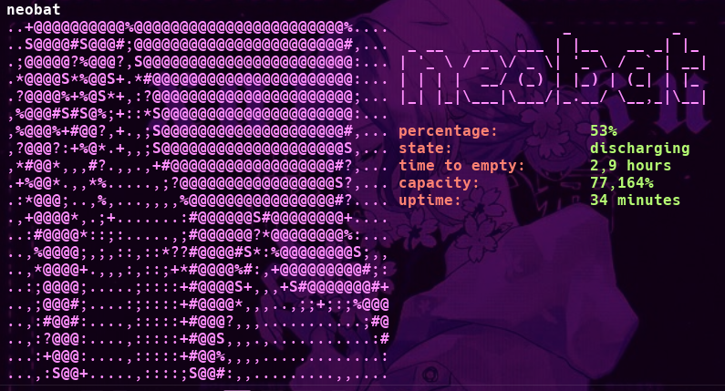

# neobat

A simple and tiny CLI tool to display battery information of your device with a customized ASCII art.

<div align="justify">
<a href='#'></img><a/>
<a href='#'></img><a/>
<a href='#'></a>
</div>

## Installation:

#### To install run

```
    git clone https://github.com/yumeniown/neobat
    cd neobat
    sudo make install
```

#### To uninstall run

```
    sudo make uninstall
```
#### To get help informaiton

```
    sudo make help 
```

## Usage:

```
neobat
```
<div align="center">
  
</div>

#### To set your own ASCII art you need to follow these steps:
  1. Add your image to the logo folder
```
cd src/logo
```  
  2. After that, to create ASCII art:
```
cd ../ascii_art/ && python3 ascii.py <logo_path> width
```
And finally your ASCII art will be saved in the logo.txt

#### To get help message 

```
    neobat --help 
```

#### To get information about current version 

```
    neobat --version
```


#### License

This project is distributed under the [Creative Commons Attribution-NonCommercial-NoDerivatives 4.0 International License](LICENSE).  
You are free to share the project for non-commercial purposes, but you must give appropriate credit, and you may not modify or create derivative works.  
For more details, see the [LICENSE](LICENSE) file.

<h5></h5> <div align="center"> <p>  </p> </div>
